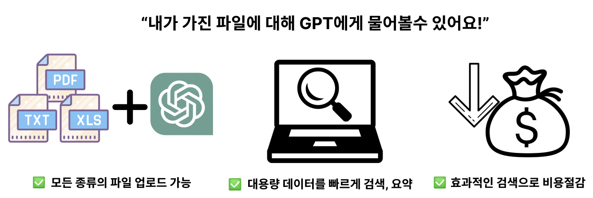
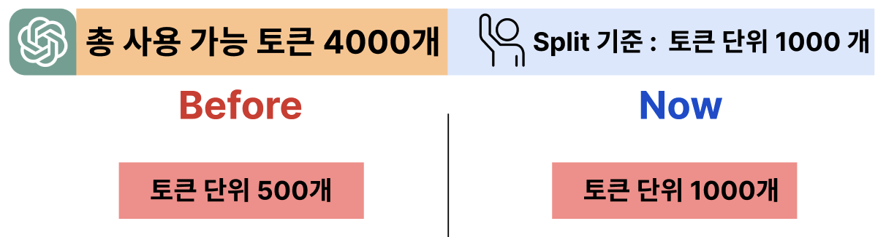

# h1             

  

   1시간 걸리는 작업을 1분 만에 끝낼 수 있도록 도와주는 웹 서비스

<!--  -->

    서비스 소개 영상 : https://youtu.be/6h0SfTX4uwk

## 팀원

  
  

## 문제 및 개선
### 데이터 저장 방식

  

    

DB에서 검색 속도 향상을 위해 Chroma DB를 사용하였습니다.  
사용자가 저장한 파일들은 임베딩 되어 벡터값으로 DB에 저장됩니다.  

  

    

기존 MySql에서 검색하였을 때보다 약 7배 향상된 검색 성능을 보였습니다.

### 검색어 변환

  

    

처음 기획은 자연어를 학습 된 GPT를 통해 Qurey 명령어로 변환하려고 하였습니다.  
비용 문제와 데이터베이스 종류 교체로 검색어 변환 방식을 교체했습니다.  
사용자의 질의를 Open AI를 사용하여 Query 벡터로 교환하였습니다. 

### 토큰 제한

  

    

토큰 제한으로 인해 대용량의 파일을 모두 GPT에게 보내는 것은 불가능 했습니다.  

  

    

이를 해결하기 위해 모든 파일을 토큰 단위로 쪼개어 저장하였습니다.  
초기에는 500 토큰 단위로 분할하였으나 응답이 부정확하였습니다.  
여러 실험 끝에 가장 정확한 응답을 생성하는 1000 토큰 단위로 수정하였습니다.  

  

    

Query 벡터와 유사한 상위 4개의 벡터를 Vector DB에서 추출하여 GPT에게 전송함으로써 토큰 제한 문제를 해결했습니다.

## 아키텍쳐

  

    

<!--

**Here are some ideas to get you started:**

🙋‍♀️ A short introduction - what is your organization all about?
🌈 Contribution guidelines - how can the community get involved?
👩‍💻 Useful resources - where can the community find your docs? Is there anything else the community should know?
🍿 Fun facts - what does your team eat for breakfast?
🧙 Remember, you can do mighty things with the power of [Markdown](https://docs.github.com/github/writing-on-github/getting-started-with-writing-and-formatting-on-github/basic-writing-and-formatting-syntax)
-->
